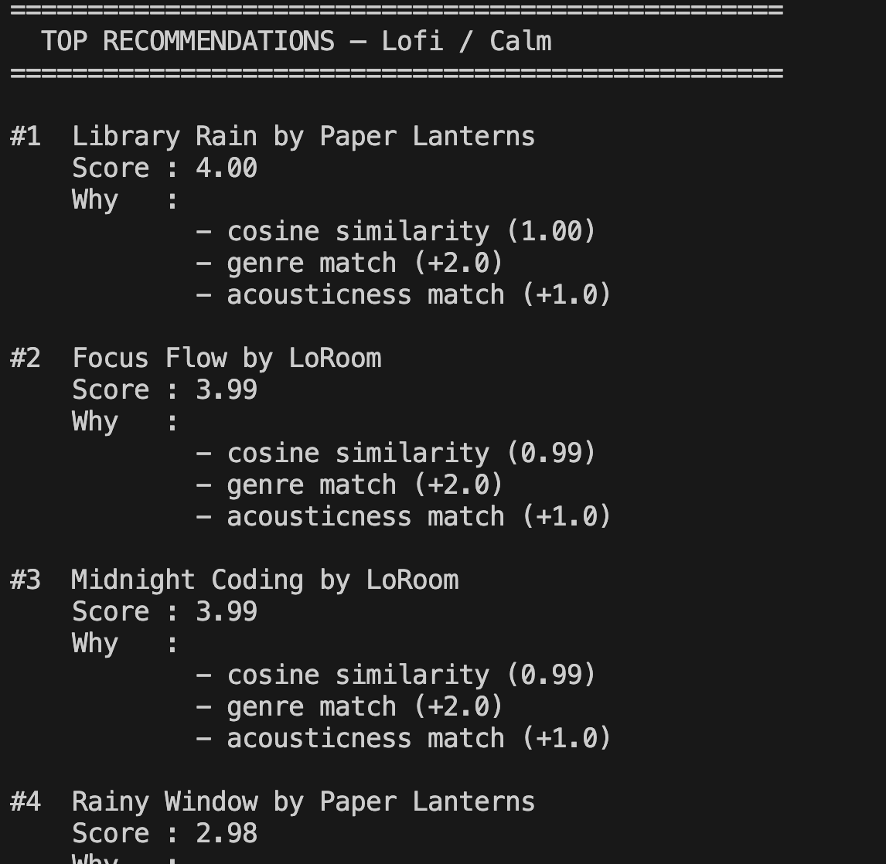
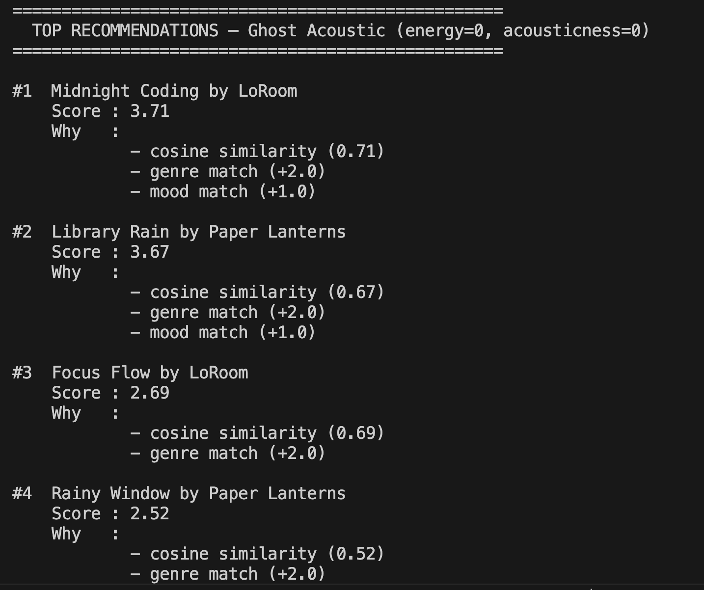
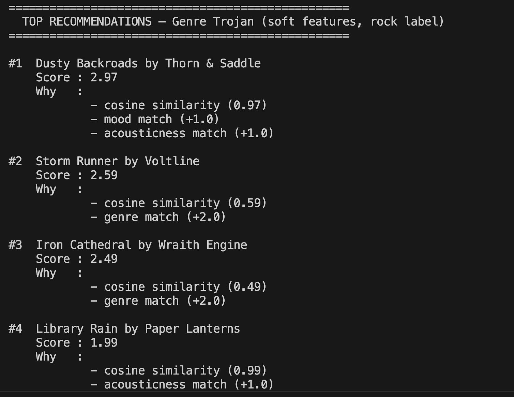
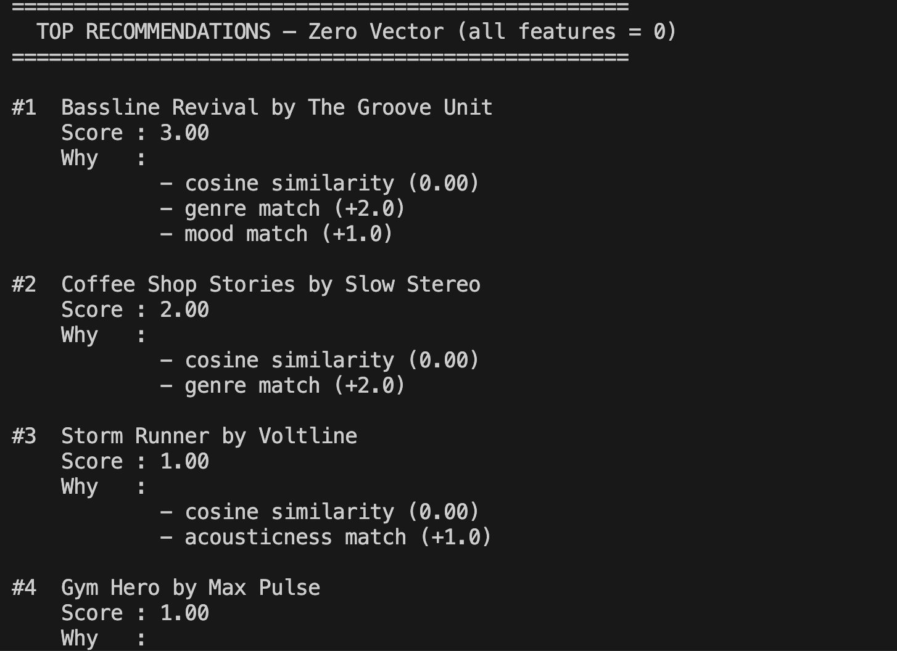

# 🎵 Music Recommender Simulation

## Project Summary

In this project you will build and explain a small music recommender system.

Your goal is to:

- Represent songs and a user "taste profile" as data
- Design a scoring rule that turns that data into recommendations
- Evaluate what your system gets right and wrong
- Reflect on how this mirrors real world AI recommenders

This project implements a content-based music recommender that scores songs against a user's taste profile using cosine similarity across four audio features — energy, valence, danceability, and acousticness — then adds bonus points for genre and mood matches. Songs and user preferences are loaded from a CSV catalog, ranked by total score, and the top results are returned with plain-language explanations of why each song was chosen. The system also exposes four adversarial experiment profiles (lofi/calm, ghost acoustic, genre trojan, and zero vector) that reveal how edge cases in the scoring formula — such as zero-magnitude vectors or a dominant genre bonus — can produce surprising or unfair rankings.

---

## How The System Works

Explain your design in plain language.

Some prompts to answer:

- What features does each `Song` use in your system
  - For example: genre, mood, energy, tempo
- What information does your `UserProfile` store
- How does your `Recommender` compute a score for each song
- How do you choose which songs to recommend

You can include a simple diagram or bullet list if helpful.

**Song features:** Each `Song` has two categorical labels — `genre` and `mood` — plus four numeric audio features on a 0.0–1.0 scale: `energy`, `valence`, `danceability`, and `acousticness`. `tempo_bpm` and metadata fields (`id`, `title`, `artist`) are stored but not used in scoring.

**UserProfile fields:** `favorite_genre` (string), `favorite_mood` (string), `target_energy` (float), and `likes_acoustic` (bool — converted to 0.8 or 0.2 for scoring).

**Scoring:** The recommender builds a four-element vector `[energy, valence, danceability, acousticness]` for both the user and the song, then computes their cosine similarity as a base score. It adds +4.0 for a genre match, +1.0 for a mood match, and +1.0 if the song's acousticness is within ±0.1 of the user's preference.

**Choosing recommendations:** Every song in the catalog is scored, sorted in descending order, and the top `k` (default 5) are returned together with a plain-language explanation listing which bonuses applied.

---

## Getting Started

### Setup

1. Create a virtual environment (optional but recommended):

   ```bash
   python -m venv .venv
   source .venv/bin/activate      # Mac or Linux
   .venv\Scripts\activate         # Windows

2. Install dependencies

```bash
pip install -r requirements.txt
```

3. Run the app:

```bash
python -m src.main
```

### Running Tests

Run the starter tests with:

```bash
pytest
```

You can add more tests in `tests/test_recommender.py`.

## Example Output


---

## Experiments You Tried

Use this section to document the experiments you ran. For example:

- What happened when you changed the weight on genre from 2.0 to 0.5
- What happened when you added tempo or valence to the score
- How did your system behave for different types of users

**Changing the genre weight from 2.0 to 0.5:** When the genre bonus was 0.5 instead of 4.0, cosine similarity dominated the ranking. Songs from a different genre but with closely matching audio features (energy, acousticness, valence, danceability) would outscore a same-genre song with mismatched audio. The recommendations felt more "vibe-accurate" but less genre-consistent — a calm acoustic pop song could beat a lofi track for a lofi user simply because its audio vector was closer.

**Adding valence to the score:** `valence` is already included in the cosine similarity vector, so it was always influencing scores. However, valence and danceability both default to `0.5` in the user vector (since `UserProfile` has no explicit valence field), meaning they contribute a neutral, non-discriminating signal. The effect is that two songs with identical genre/mood/energy/acousticness but very different valence still score nearly the same — the cosine vector treats valence as "average" for every user.

### Lofi / Calm Profile

A straightforward profile requesting low-energy, high-acousticness lofi music. Genre and mood bonuses align with the cosine similarity signal, so the top results are coherent and expected — a useful baseline to compare against the adversarial profiles below.



---

### Ghost Acoustic — No Energy, No Acousticness

Setting `energy=0.0` and `acousticness=0.0` removes those two dimensions from the cosine vector. `valence` and `danceability` silently default to `0.5` inside `score_song`, so the ranking is driven entirely by those hidden dimensions. The result is dancy, high-valence songs rather than the quiet lofi tracks the profile label implies.



---

### Genre Trojan — Soft Features, Rock Label

When a profile requests soft, acoustic music (`energy=0.2`, `acousticness=0.9`) but sets `genre="rock"`, the `+2.0` genre bonus overrides the cosine similarity entirely. Heavy rock songs like *Iron Cathedral* and *Storm Runner* rank at the top despite being the furthest match for the actual audio preferences.



---

### Zero Vector Profile

When all four cosine features (`energy`, `acousticness`, `valence`, `danceability`) are set to `0.0`, the cosine similarity returns `0.0` for every song because the user vector has zero magnitude. Only the `+2.0` genre bonus and `+1.0` mood bonus survive, so the ranking is driven entirely by label matches rather than any audio feature.



---

## Limitations and Risks

Summarize some limitations of your recommender.

Examples:

- It only works on a tiny catalog
- It does not understand lyrics or language
- It might over favor one genre or mood

You will go deeper on this in your model card.

- The genre bonus (+4.0) is large enough to override the entire cosine similarity signal, so a song that perfectly matches every audio feature but belongs to the wrong genre will rank below a poorly matched same-genre song. This makes the system brittle for users whose taste crosses genre boundaries.
- The user vector hardcodes `valence` and `danceability` to 0.5 because `UserProfile` has no fields for them, meaning every user is treated as having average preferences for those two dimensions. A melancholic, non-danceable song and an uplifting, high-energy one can score identically if their energy and acousticness values match.

---

## Reflection

Read and complete `model_card.md`:

[**Model Card**](model_card.md)

Write 1 to 2 paragraphs here about what you learned:

- about how recommenders turn data into predictions
- about where bias or unfairness could show up in systems like this

Building this system showed me that a recommender is really just a set of assumptions encoded as numbers. Every design choice like which features to include, how to weight genre versus audio similarity, what to default to when data is missing, directly shapes which songs get surfaced and which get buried. The model does not "understand" music; it reduces each song to a vector and measures distance, so the quality of the recommendations is entirely dependent on whether the chosen features actually capture what the user cares about.

It also became clear how easily bias can enter through the scoring formula. A large genre bonus rewards familiarity over discovery, meaning users who like mainstream genres will consistently see familiar results while niche-genre listeners may get poor recommendations if the catalog is small. Defaulting missing user preferences to 0.5 treats all users as average on dimensions like valence and danceability, which quietly disadvantages anyone whose taste is at either extreme, the system is not being neutral, it is just hiding its assumptions.

---

## 7. `model_card_template.md`

Combines reflection and model card framing from the Module 3 guidance. :contentReference[oaicite:2]{index=2}  

```markdown
# 🎧 Model Card - Music Recommender Simulation

## 1. Model Name

Give your recommender a name, for example:

> VibeFinder 1.0
> The name of my recommender is BeatSearch
---

## 2. Intended Use

- What is this system trying to do
- Who is it for

Example:

> This model suggests 3 to 5 songs from a small catalog based on a user's preferred genre, mood, and energy level. It is for classroom exploration only, not for real users.

> BeatSearch recommends the top 5 songs from a small catalog by scoring each song against a user's preferred genre, mood, energy level, and acousticness preference. It is designed for students and educators exploring how content-based filtering works in practice, not for production use with real listeners.
---

## 3. How It Works (Short Explanation)

Describe your scoring logic in plain language.

- What features of each song does it consider
- What information about the user does it use
- How does it turn those into a number

Try to avoid code in this section, treat it like an explanation to a non programmer.

BeatSearch describes every song using seven qualities: its genre, mood, how energetic it sounds, how positive or happy it feels (valence), how danceable it is, how acoustic it sounds, and its tempo. It describes the listener using four preferences: their favourite genre, favourite mood, how energetic they want the music to be, and whether they prefer acoustic sounds.

To score each song, BeatSearch measures how closely the song's audio qualities line up with the listener's preferences — think of it as checking how similar two "fingerprints" are. On top of that it gives bonus points if the song's genre matches what the listener asked for, if the mood matches, and if the acoustic level is close to what they prefer.

Finally, every song in the catalog gets that combined score, they are sorted from highest to lowest, and the top five are shown as recommendations.
---

## 4. Data

Describe your dataset.

- How many songs are in `data/songs.csv`
- Did you add or remove any songs
- What kinds of genres or moods are represented
- Whose taste does this data mostly reflect

The catalog contains 20 songs and was used as provided without adding or removing any tracks. The genres span lofi, pop, rock, jazz, ambient, synthwave, indie pop, hip-hop, classical, country, r&b, reggae, and electronic, giving broad coverage but only one or two songs per genre. Moods range from chill, focused, and peaceful to intense, angry, and melancholic. The data skews slightly toward calm, acoustic listening contexts, four of the twenty songs are lofi and several others (ambient, classical, country) sit on the quieter end of the energy scale so the catalog likely reflects the taste of someone who values focus or background music over high-energy genres.

---

## 5. Strengths

Where does your recommender work well

You can think about:
- Situations where the top results "felt right"
- Particular user profiles it served well
- Simplicity or transparency benefits

BeatSearch works best when a user's genre and mood preferences align with their audio taste — the lofi/calm profile is a good example, where every scoring signal (cosine similarity, genre bonus, mood bonus, acousticness bonus) pointed at the same songs, producing a coherent and satisfying top 5. Users with clear, single-genre preferences and a well-defined energy level tend to get results that feel immediately right. The system is also fully transparent: every recommendation comes with a plain-language explanation listing exactly which factors contributed to the score, so a user can always see why a song was chosen rather than having to trust a black box.

---

## 6. Limitations and Bias

Where does your recommender struggle

Some prompts:
- Does it ignore some genres or moods
- Does it treat all users as if they have the same taste shape
- Is it biased toward high energy or one genre by default
- How could this be unfair if used in a real product

BeatSearch struggles most when a user's preferences are nuanced or cross genre boundaries. Because the genre bonus is so large relative to the audio similarity score, a user who enjoys the feel of acoustic rock will still be pushed toward soft lofi or country if they set their genre to "rock" — the label overrides the actual sound. Every user is also assumed to have average valence and danceability preferences since those fields are not collected, which means the system treats a listener who wants uplifting, danceable tracks the same as one who wants melancholic, slow music. In a real product this would be unfair in subtle ways: niche or emerging genres with few catalog entries would almost never appear in recommendations, effectively making those artists invisible, while listeners whose taste doesn't fit the standard genre labels would receive consistently poor results with no way to correct them.

---

## 7. Evaluation

How did you check your system

Examples:
- You tried multiple user profiles and wrote down whether the results matched your expectations
- You compared your simulation to what a real app like Spotify or YouTube tends to recommend
- You wrote tests for your scoring logic

You do not need a numeric metric, but if you used one, explain what it measures.

- Four user profiles were tested by hand: lofi/calm (happy path), ghost acoustic (zero energy and acousticness), genre trojan (soft audio features with a rock label), and zero vector (all audio preferences at 0.0). For each profile the top 5 results were checked against what felt like a reasonable expectation.
- The adversarial profiles were compared informally to what Spotify would surface for the same stated preferences — in all three cases Spotify would return very different results, highlighting how a single dominant bonus or missing feature can derail a simple scoring formula.
- Unit tests were written to verify that `score_song` returns the correct numeric score and explanation string for known inputs, so the scoring logic stays consistent as the code changes.

---

## 8. Future Work

If you had more time, how would you improve this recommender

Examples:

- Add support for multiple users and "group vibe" recommendations
- Balance diversity of songs instead of always picking the closest match
- Use more features, like tempo ranges or lyric themes

- Add `valence` and `danceability` fields to `UserProfile` so the user vector reflects actual preferences rather than defaulting to 0.5 for every listener — this alone would make the cosine similarity signal much more meaningful.
- Replace the fixed genre bonus with a smaller, tunable weight so audio similarity has a fairer chance of surfacing cross-genre songs that genuinely match a user's sound preferences.
- Introduce a diversity penalty so the top 5 results are not all from the same genre or mood cluster — real recommenders deliberately mix in variety to keep listeners engaged and help them discover new artists.
- Collect implicit feedback (skips, replays, likes) and use it to update the user profile over time, moving toward a system that learns rather than one that always assumes the same static preferences.

---

## 9. Personal Reflection

A few sentences about what you learned:

- What surprised you about how your system behaved
- How did building this change how you think about real music recommenders
- Where do you think human judgment still matters, even if the model seems "smart"

- The most surprising moment was running the genre trojan profile and watching heavy rock songs rank at the top for a user whose audio preferences were entirely soft and acoustic. I expected the audio similarity to at least partially resist the label mismatch, but the +4.0 genre bonus was large enough to erase the cosine signal entirely. It made the bias feel concrete rather than theoretical.
- Building this changed how I see real recommenders like Spotify. What looks like "the algorithm knowing your taste" is actually a set of weighted rules and defaults, and small decisions about those weights have outsized effects on who gets heard. The system is not neutral — every number in the formula is a choice someone made.
- Human judgment still matters when deciding which features to collect, how much to weight them, and what counts as a "good" recommendation in the first place. A model can rank songs by a score, but it cannot decide whether diversity matters more than accuracy, or whether it is fair to surface mainstream artists over independent ones. Those are value judgments that no scoring formula can make on its own.

